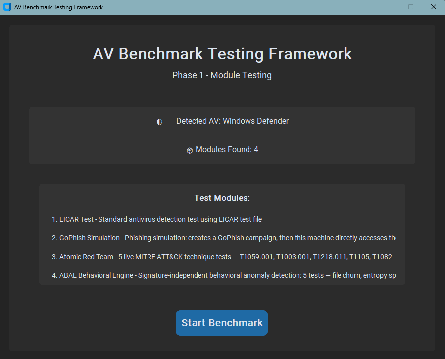
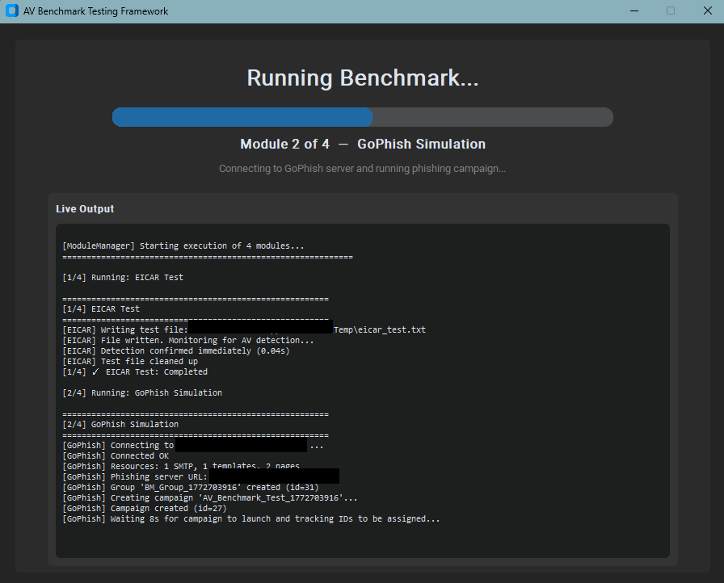
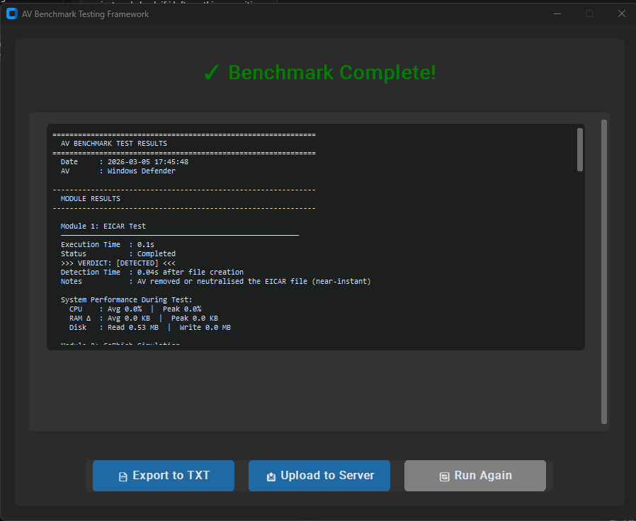
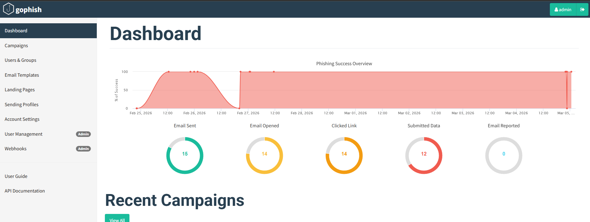
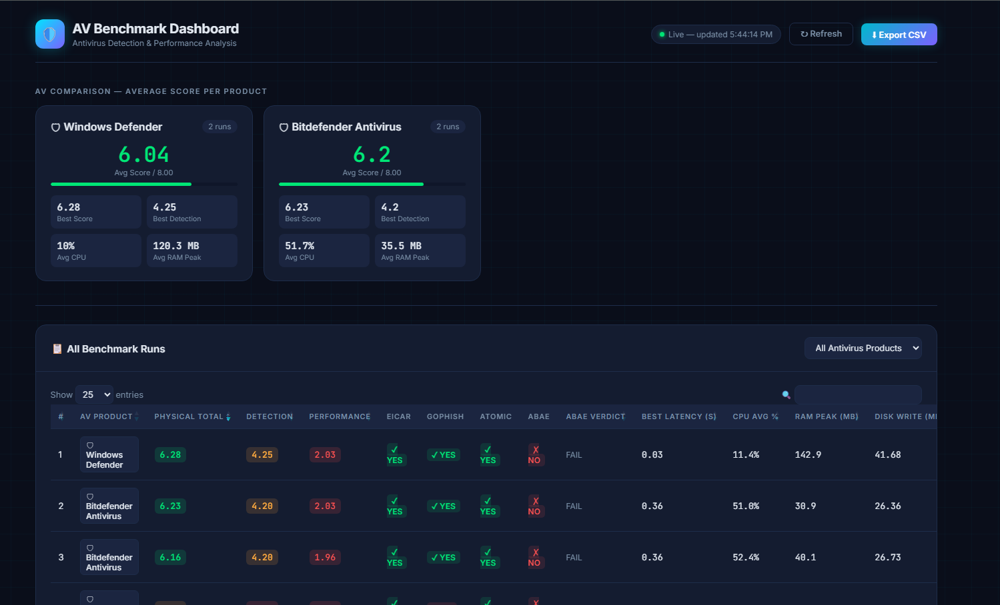

# AV Benchmark Testing Framework — Phase 5

Modern GUI application for benchmarking antivirus software across four test layers with weighted scoring and server upload.

## Quick Start

```powershell
python main.py
```

## Features

- ✅ **GUI Interface** — Modern dark theme using CustomTkinter
- ✅ **Antivirus Detection** — Automatically detects installed AV
- ✅ **Dynamic Modules** — Add modules without code changes
- ✅ **System Monitoring** — Tracks CPU, RAM, Disk I/O per module
- ✅ **Weighted Scoring** — 8-point Physical Score computed after every run
- ✅ **Results Export** — Saves detailed reports to TXT files
- ✅ **Upload to Server** — POSTs results to Ubuntu SQLite via PHP API

---

## The 4-Layer Evaluation Stack

| Layer | Module | What It Measures |
|-------|--------|----------------|
| 1 | EICAR Test | Basic signature functionality |
| 2 | GoPhish Simulation | User-layer phishing attack resilience |
| 3 | ATT&CK Simulation | Advanced attack technique detection |
| 4 | ABAE Behavioral Engine | Unknown behavioral anomaly defense |

---

## Scoring Model (Physical Score — 8 pts)

> Usability score (2 pts) is added separately by the comparison website. Total = 10 pts.

| Component | Max | Logic |
|-----------|-----|-------|
| **Detection Score** | 5 pts | `(modules_detected / total) × 3` + `max(0, 2 − best_latency_s × 0.15)` |
| **Performance Score** | 3 pts | Start at 3.0, deduct: `cpu_avg × 0.015` + `ram_peak_mb × 0.005` + `disk_write_mb × 0.002` |

Scores appear at the bottom of every TXT report and in the upload payload.

---

## Modules

### Module 1: EICAR Test ✅ FUNCTIONAL
Standard signature detection test using the EICAR test file.

### Module 2: GoPhish Phishing Simulation ✅ FUNCTIONAL
Live phishing simulation against a GoPhish server (Ubuntu VM). Campaign data preserved as evidence.

Configure: `modules/module_2_gophish/gophish_config.json`

### Module 3: ATT&CK Simulation ✅ FUNCTIONAL
5 live MITRE ATT&CK technique tests (Python stdlib only).

| ATT&CK ID | Technique | AV Target |
|-----------|-----------|-----------|
| T1059.001 | PowerShell encoded `IEX`/`DownloadString` | AMSI / script-block logging |
| T1003.001 | LSASS dump via `comsvcs.dll` (rundll32) | Credential-dumping heuristic |
| T1218.011 | Rundll32 `javascript:` LOLBin | Living-off-the-land heuristic |
| T1105     | EICAR string saved as `.exe` on disk | Real-time file scanner |
| T1082     | Sysinfo recon → base64 stage → loopback exfil POST | Behavioural chain |

### Module 4: ABAE Behavioral Engine ✅ FUNCTIONAL
Signature-independent behavioral anomaly detection — 5 tests, no external tools.

| Test | Dimension | Detection Signal |
|------|-----------|-----------------|
| B-01 | Rapid File Manipulation | `PermissionError` on file write/rename during 300-file churn |
| B-02 | Entropy Spike Simulation | AV blocks `os.urandom()` writes (≥7.5 Shannon bits/byte) |
| B-03 | Process Burst Activity | Subprocess spawn denied or file I/O storm blocked |
| B-04 | Registry Modification | `WindowsError` on `HKCU\Software\ABAE_*` write |
| B-05 | Behavioral Consistency | AV detects in majority of 3 repeated variation runs |

**PASS criteria:** ≥ 3 of 5 detected (configurable in `abae_config.json`).

---

## Server Upload (Phase 5)

After each benchmark run, click **📤 Upload to Server** to POST results to the Ubuntu server.

### Python side
- `score_calculator.py` — computes the 8-pt Physical Score from all module metrics
- `results_handler.py` — `build_upload_payload()` + `upload_to_server()` stringify and POST the data
- `main.py` — upload button, background thread, success/fail popup

### Server side (`server/` directory)
| File | Deploy to Ubuntu | Purpose |
|------|-----------------|---------|
| `upload_results.php` | `/var/www/html/upload_results.php` | Receives POST, inserts into SQLite |
| `get_results.php`    | `/var/www/html/get_results.php`    | Comparison website data API |

Server URL configured in `main.py`:
```python
SERVER_URL = ""
```

#### SQLite Schema
```sql
benchmark_results (id, run_id, av_name, timestamp,
  detection_score, performance_score, physical_total,
  eicar_detected, gophish_detected, atomic_detected, abae_detected, abae_verdict,
  best_detection_latency_s, cpu_avg, ram_peak_mb, disk_write_mb, raw_json)
```


## Installation

```powershell
pip install -r requirements.txt
```

## Project Structure

```
Major Project/
├── main.py                    # GUI application
├── module_manager.py          # Dynamic module discovery
├── system_monitor.py          # Performance tracking
├── av_detector.py             # Antivirus detection
├── score_calculator.py        # Weighted scoring engine
├── results_handler.py         # Results compilation, export, upload
├── modules/
│   ├── base_module.py
│   ├── module_1_eicar/        # EICAR signature test
│   ├── module_2_gophish/      # GoPhish phishing simulation
│   ├── module_3_atomic/       # MITRE ATT&CK simulation
│   └── module_4_abae/         # Adaptive Behavioral Anomaly Engine
│       ├── module.py
│       ├── abae_engine.py
│       └── abae_config.json
├── server/                    # Deploy these to Ubuntu
│   ├── upload_results.php
│   └── get_results.php
└── results/                   # Exported TXT reports
```

## Requirements

- Python 3.11+
- Windows 10 / 11
- CustomTkinter ≥ 5.2.0
- psutil ≥ 5.9.0
- WMI ≥ 1.5.1

## Phase Status

| Phase | Scope | Status |
|-------|-------|--------|
| Phase 1 | GUI + EICAR | ✅ Complete |
| Phase 2 | GoPhish phishing simulation | ✅ Complete |
| Phase 3 | ATT&CK simulation (5 techniques) | ✅ Complete |
| Phase 4 | ABAE behavioral engine (5 tests) | ✅ Complete |
| Phase 5 | Scoring + server upload (SQLite/PHP) | ✅ Complete |
| Phase 6 | Comparison website frontend | 🔲 Planned |

## License

## Screenshots

### Benchmark Tool


### Benchmark Tool In Progress


### Benchmark Result


### GoPhish Dashboard


### Dashboard



Educational Project — UNITAR Learn
